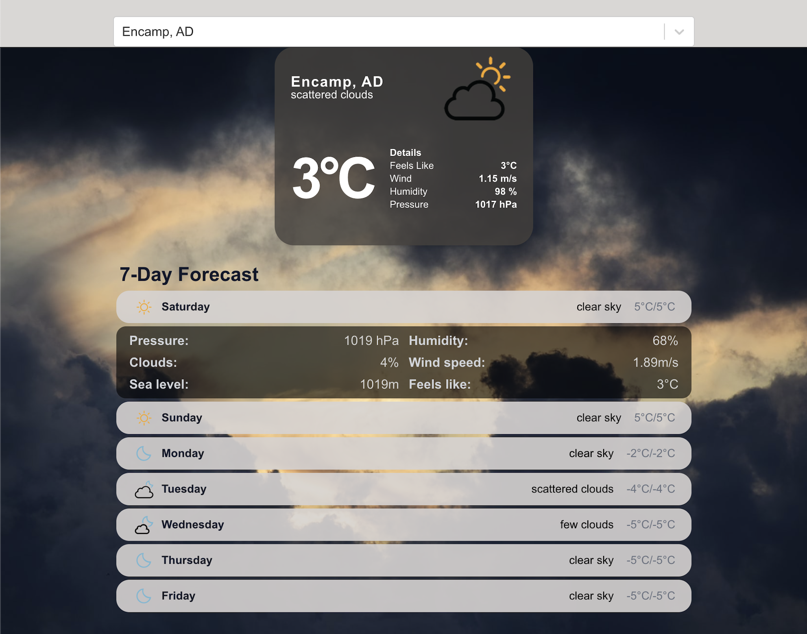
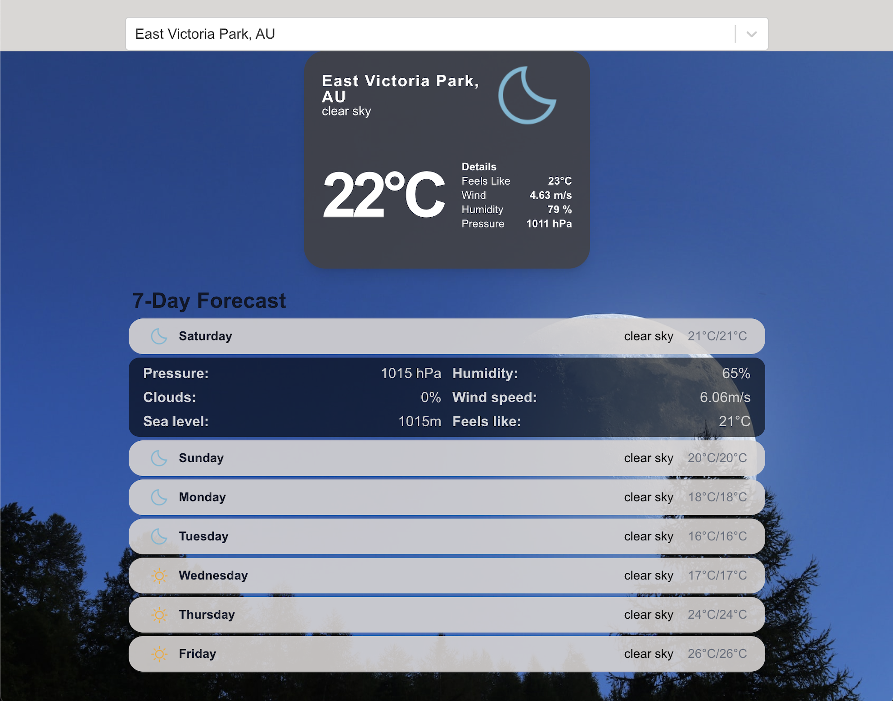

# React Weather App

Weather app which will be continually improved overtime as my React skills improve.

## Table of contents

- [Overview](#overview)
  - [Screenshot](#screenshot)
  - [Links](#links)
- [My process](#my-process)
  - [Built with](#built-with)
  - [What I learned](#what-i-learned)
  - [Continued development](#continued-development)
- [Author](#author)
- [Acknowledgments](#acknowledgments)

## Overview

### Screenshot

Working Application:

### Links

- [View Github Repository](https://github.com/r-tom90/weather-app)
- [View Live Site](https://my-weather-app-ashen.vercel.app/)

## My process

### Built with

- API Endpoints:

  - [GeoDB Cities](https://rapidapi.com/wirefreethought/api/geodb-cities)
  - [OpenWeather](https://openweathermap.org/)

- Packages used:
  - [Select Async Paginate ](https://www.npmjs.com/package/react-select-async-paginate?activeTab=readme) - Search Input
  - [Accessible Accordion](https://www.npmjs.com/package/react-accessible-accordion) - Expand Content
  - [Tailwind CSS](https://tailwindcss.com/#what-is-tailwind) - For styles
  - [React](https://reactjs.org/) - JS library
  - [Vite](https://vitejs.dev/) - React Bootstrap

### What I learned

- Use of React functional components through bootstrapping Vite.
- Accessing OpenWeather and GeoDB API points to display information fetched.

### Continued development

- Implementation of:
  - Changing Background Images based on weather.
  - Refactor code.

## Author

- Website - [Portfolio deployed with vercel](https://richard-tom-portolio.vercel.app/)
- GitHub - [@r-tom90](https://github.com/r-tom90)
- LinkedIn - [@richard-tom](https://www.linkedin.com/in/richard-tom-81b0956b/)
- Twitter - [@CryptoFallen](https://twitter.com/CryptoFallen)
- Medium - [@richardtom](https://medium.com/@richardtom_79153)

## Acknowledgments

This was built with the tutorial from [FreeCodeCamp YouTube Channel](https://www.youtube.com/watch?v=Reny0cTTv24) with modifications to the base tutorial.
